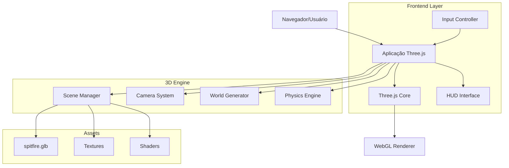
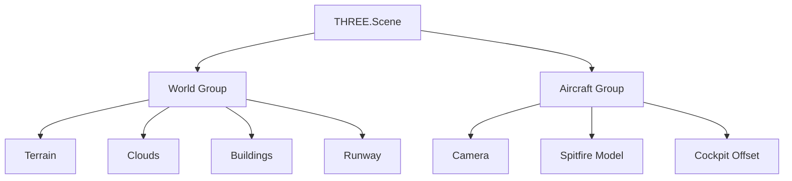

## 1. Arquitetura do Sistema



## 2. Stack Tecnológica

* **Frontend:** Three.js\@0.160.0 + ES6 Modules

* **Ferramenta de inicialização:** Vite (para desenvolvimento local)

* **Backend:** Nenhum (aplicação client-side pura)

* **Assets:** Arquivos estáticos (GLB, texturas, shaders)

* **Build:** HTML único com import maps (sem build necessário)

## 3. Definições de Rotas

| Rota          | Propósito                                  |
| ------------- | ------------------------------------------ |
| /             | Página principal do simulador (index.html) |
| /spitfire.glb | Modelo 3D do avião (asset estático)        |

## 4. Estrutura de Arquivos

```
simulador/
├── index.html              # Arquivo principal HTML
├── spitfire.glb           # Modelo 3D do Spitfire
├── assets/                # Assets opcionais
│   ├── textures/          # Texturas do terreno e céu
│   └── shaders/          # Shaders GLSL personalizados
└── js/                    # Código JavaScript modular
    ├── main.js           # Entry point e inicialização
    ├── world.js          # Gerador de mundo e terreno
    ├── aircraft.js       # Sistema de controle do avião
    ├── hud.js           # Interface HUD
    └── physics.js       # Física básica de voo
```

## 5. Arquitetura do Código

### 5.1 Sistema de Hierarquia 3D



### 5.2 Classes Principais

**AircraftController:**

```javascript
class AircraftController {
    constructor(scene, model) {
        this.group = new THREE.Group(); // Container principal
        this.model = model;             // Modelo GLTF
        this.camera = new THREE.PerspectiveCamera();
        this.setupCamera();
        this.setupControls();
    }
    
    update(deltaTime) {
        // Atualiza rotações baseado em controles
        // Aplica física de voo
        // Atualiza HUD
    }
}
```

**WorldGenerator:**

```javascript
class WorldGenerator {
    constructor(scene) {
        this.terrain = this.createTerrain();
        this.sky = this.createSky();
        this.clouds = this.createClouds();
        this.buildings = this.createBuildings();
    }
    
    update(aircraftPosition) {
        // Move mundo baseado na posição do avião
        // Mantém terreno infinito
        // Atualiza LOD (Level of Detail)
    }
}
```

## 6. Sistema de Física

### 6.1 Parâmetros de Voo

```javascript
const flightParameters = {
    maxSpeed: 300,        // unidades/segundo
    minSpeed: 50,         // unidades/segundo
    rollRate: 1.5,        // radianos/segundo
    pitchRate: 1.0,       // radianos/segundo
    turnFactor: 0.8,      // fator de guinada automática
    gravity: -9.8,        // gravidade (para efeitos)
    drag: 0.98            // coeficiente de arrasto
};
```

### 6.2 Controles de Input

```javascript
const controls = {
    ArrowLeft: 'rollLeft',
    ArrowRight: 'rollRight', 
    ArrowUp: 'pitchDown',
    ArrowDown: 'pitchUp'
};
```

## 7. Otimizações de Performance

### 7.1 LOD (Level of Detail)

* Terreno com segmentos variáveis baseado na distância

* Nuvens com billboards para distâncias longas

* Modelos simplificados para objetos distantes

### 7.2 Culling

* Frustum culling para objetos fora da visão

* Distance culling para objetos muito distantes

* Occlusion culling simples para montanhas

### 7.3 Batching

* Terreno único com geometria otimizada

* Nuvens instanciadas

* Prédios com geometrias reutilizadas

## 8. Sistema de Renderização

### 8.1 Pipeline de Renderização

1. **Shadow Pass:** Renderiza sombras para objetos principais
2. **Main Pass:** Renderiza cena principal com iluminação
3. **Post-processing:** Aplica efeitos de profundidade e color grading

### 8.2 Shaders Personalizados

```glsl
// Vertex Shader para terreno
uniform float time;
varying vec3 vPosition;

void main() {
    vPosition = position;
    vec3 newPosition = position;
    newPosition.y += sin(position.x * 0.01 + time) * 10.0;
    gl_Position = projectionMatrix * modelViewMatrix * vec4(newPosition, 1.0);
}
```

## 9. Sistema de HUD

### 9.1 Elementos da Interface

```javascript
const HUDElements = {
    speed: document.getElementById('speed'),
    altitude: document.getElementById('altitude'),
    pitch: document.getElementById('pitch'),
    roll: document.getElementById('roll'),
    horizon: document.getElementById('horizon')
};
```

### 9.2 Atualização em Tempo Real

* Atualização a 60 FPS

* Interpolação suave para valores

* Feedback visual de controles ativos

## 10. Tratamento de Erros

### 10.1 Fallbacks

* Texturas padrão se falhar carregamento

* Modelo placeholder se GLTF falhar

* Controles touch se teclado não disponível

### 10.2 Debugging

* Console com informações de performance

* Stats.js para monitoramento de FPS

* Modo debug com informações extras

