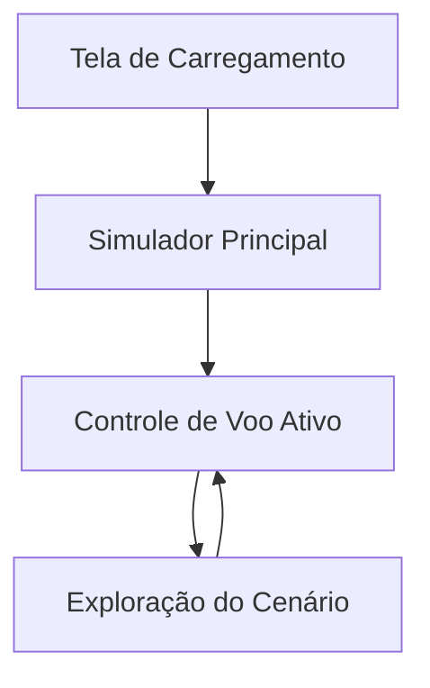

## 1. Visão Geral do Produto

Simulador de voo em primeira pessoa de um Spitfire utilizando Three.js, onde o cockpit permanece fixo na tela como visão do piloto e todo o mundo se move ao redor do avião. O objetivo é criar uma experiência imersiva e realista de pilotagem com controles simples e visual atraente.

**Problema resolvido:** Simulação acessível de voo sem necessidade de softwares complexos ou instalações.
**Público-alvo:** Entusiastas de aviação, gamers casuais e desenvolvedores interessados em Three.js.
**Valor de mercado:** Experiência de voo realista diretamente no navegador, acessível e visualmente impressionante.

## 2. Funcionalidades Principais

### 2.1 Papéis de Usuário
| Papel | Método de Acesso | Permissões |
|-------|------------------|------------|
| Piloto | Acesso direto via navegador | Controlar avião, visualizar HUD, explorar cenário |
| Visitante | Acesso direto via navegador | Apenas observar demonstração automática |

### 2.2 Módulos de Funcionalidades

Nosso simulador consiste nas seguintes páginas principais:
1. **Simulador Principal**: Visão em primeira pessoa do cockpit com HUD, controles de voo e mundo 3D.
2. **Tela de Carregamento**: Interface inicial com progresso de carregamento do modelo 3D e assets.

### 2.3 Detalhamento das Páginas

| Nome da Página | Módulo | Descrição das Funcionalidades |
|----------------|---------|-------------------------------|
| Tela de Carregamento | Barra de progresso | Mostrar carregamento do modelo Spitfire e texturas do cenário |
| Tela de Carregamento | Dicas de controle | Exibir instruções básicas de pilotagem enquanto carrega |
| Simulador Principal | Visão do cockpit | Câmera fixa no cockpit com perspectiva realista do piloto |
| Simulador Principal | HUD de voo | Exibir velocidade, altitude, pitch, roll e indicadores de voo |
| Simulador Principal | Controles de voo | Roll com setas esquerda/direita, pitch com setas cima/baixo |
| Simulador Principal | Mundo 3D | Terreno com elevações, céu realista, nuvens e efeitos atmosféricos |
| Simulador Principal | Física de voo | Yaw automático baseado em roll, movimento suave e realista |
| Simulador Principal | Cenário dinâmico | Pista de pouso, cidade, vegetação e montanhas ao redor |

## 3. Fluxo de Navegação

**Fluxo Principal:**
1. Usuário acessa o simulador
2. Tela de carregamento aparece enquanto assets são carregados
3. Simulador principal inicia com avião na pista
4. Piloto controla o avião através das setas do teclado
5. HUD fornece feedback constante do estado de voo

## 4. Design da Interface

### 4.1 Estilo Visual
- **Cores principais:** Azul céu (#87CEEB), verde terreno (#6B8E23), cinza metálico para HUD
- **Estilo de botões:** Minimalista, sem botões visíveis (controles via teclado)
- **Fontes:** System UI, Roboto, Arial - famílias de fontes do sistema para performance
- **Estilo de layout:** Tela cheia, interface sobreposta (HUD) minimalista
- **Ícones/Emojis:** Texto simples e símbolos ASCII para indicadores de voo

### 4.2 Elementos de Interface

| Página | Módulo | Elementos de UI |
|--------|---------|------------------|
| Simulador Principal | HUD | Painel semi-transparente no topo esquerdo com velocidade, altitude, indicadores de pitch/roll |
| Simulador Principal | Indicadores visuais | Setas mostrando controles ativos, borda da tela com efeito de velocidade |
| Simulador Principal | Cenário 3D | Céu com gradiente realista, terreno texturizado, nuvens volumétricas |

### 4.3 Responsividade
- **Desktop-first:** Otimizado para desktop com teclado completo
- **Adaptativo mobile:** Controles touch básicos para dispositivos móveis (opcional)
- **Performance:** Ajuste automático de qualidade baseado na capacidade do dispositivo

## 5. Requisitos Técnicos

### 5.1 Performance
- Manter 60 FPS em dispositivos modernos
- Tempo de carregamento inicial < 10 segundos
- Uso de memória < 500MB

### 5.2 Compatibilidade
- Navegadores modernos (Chrome, Firefox, Safari, Edge)
- Suporte WebGL 2.0
- Resoluções de tela de 768p até 4K

### 5.3 Assets Necessários
- Modelo 3D: spitfire.glb (já disponível)
- Texturas: terreno, céu, nuvens
- Shaders: céu dinâmico, efeitos atmosféricos